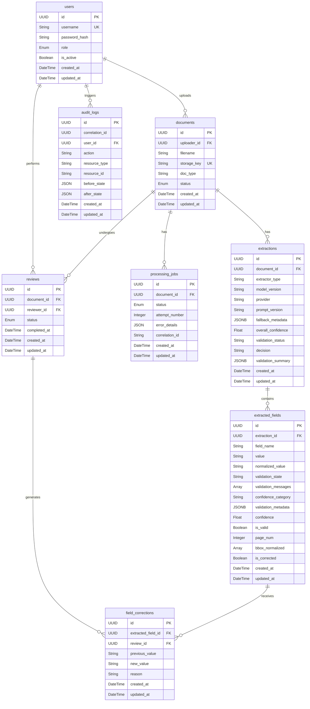

# ClinExtract Database Deep Dive

This document provides a comprehensive overview of the PostgreSQL database schema powering ClinExtract, covering every table's structure, relationships, constraints, and lifecycle.

## Table of Contents
- [Entity Relationship Diagrams](#entity-relationship-diagrams)
- [Database Tables](#database-tables)
- [Migration History](#migration-history)
- [Architectural Decisions](#architectural-decisions)

---

## Entity Relationship Diagrams

### Mermaid ER Diagram



### ASCII ER Diagram

```text
+----------------+       +-------------------+       +-------------------+
|     users      |       |     documents     |       |  processing_jobs  |
+----------------+       +-------------------+       +-------------------+
| PK id          |<--+   | PK id             |<---+--| PK id             |
| UK username    |   |   | FK uploader_id    |    |  | FK document_id    |
|    ...         |   +---| UK storage_key    |    |  |    ...            |
+----------------+       |    ...            |    |  +-------------------+
        ^                +-------------------+    |
        |                          ^              |  +-------------------+
        |                          |              +--|    extractions    |
        +---------------+          +-----------+     +-------------------+
                        |                      |     | PK id             |
+----------------+      | +------------------+ |     | FK document_id    |<-+
|   audit_logs   |      | |      reviews     | |     |    ...            |  |
+----------------+      | +------------------+ |     +-------------------+  |
| PK id          |      +-| PK id            | |                            |
| FK user_id     |        | FK document_id   |-+     +-------------------+  |
|    ...         |        | FK reviewer_id   |       | extracted_fields  |  |
+----------------+        |    ...           |<---+  +-------------------+  |
                          +------------------+    |  | PK id             |  |
                                                  +--| FK extraction_id  |--+
                                                  |  |    ...            |<-+
                                                  |  +-------------------+  |
                                                  |                         |
                                                  |  +-------------------+  |
                                                  |  | field_corrections |  |
                                                  |  +-------------------+  |
                                                  +--| PK id             |  |
                                                     | FK review_id      |  |
                                                     | FK ext_field_id   |--+
                                                     |    ...            |
                                                     +-------------------+
```

---

## Database Tables

### 1. `users`
Stores user credentials and roles for RBAC.
- **Columns & Types:**
  - `id` (UUID, PK)
  - `username` (String, Indexed, Unique)
  - `password_hash` (String)
  - `role` (Enum: ADMIN, REVIEWER, OPERATOR, VIEWER)
  - `is_active` (Boolean, Default: True)
  - `created_at`, `updated_at` (DateTime)
- **Relationships:** One-to-Many with `documents` (uploader), `reviews` (reviewer), `audit_logs`.
- **Immutability Rules:** Soft deletion or inactivation via `is_active`.
- **Lifecycle:** Created by Admin seed or invitation, remains until deactivated.

### 2. `documents`
Tracks uploaded documents as they flow through the extraction system.
- **Columns & Types:**
  - `id` (UUID, PK)
  - `uploader_id` (UUID, FK -> users.id)
  - `filename` (String)
  - `storage_key` (String, Unique)
  - `doc_type` (String, Nullable)
  - `status` (Enum: UPLOADED, PROCESSING, AUTO_ACCEPTED, REVIEW_REQUIRED, REVIEW_IN_PROGRESS, HUMAN_APPROVED, HUMAN_REJECTED, FAILED)
  - `created_at`, `updated_at` (DateTime)
- **Relationships:** One-to-Many with `processing_jobs`, `extractions`, `reviews`. Cascade delete orphan.
- **Lifecycle:** Transitions status from UPLOADED -> PROCESSING -> (AUTO_ACCEPTED | REVIEW_REQUIRED | FAILED).
- **Immutability Rules:** `storage_key` is immutable once set. File binaries are not stored here (in S3).

### 3. `processing_jobs`
Represents asynchronous Celery tasks processing documents.
- **Columns & Types:**
  - `id` (UUID, PK)
  - `document_id` (UUID, FK -> documents.id, Indexed)
  - `status` (Enum: QUEUED, RUNNING, SUCCEEDED, FAILED, RETRYING, Indexed)
  - `attempt_number` (Integer, Default: 1)
  - `error_details` (JSON, Nullable)
  - `correlation_id` (String, Indexed, Nullable)
  - `created_at`, `updated_at` (DateTime)
- **Relationships:** Many-to-One with `documents`.
- **Lifecycle:** Created when doc is uploaded. Updated by worker. Terminal state: SUCCEEDED or FAILED.

### 4. `extractions`
Top-level entity storing the outcome of an extraction run (OCR/AI).
- **Columns & Types:**
  - `id` (UUID, PK)
  - `document_id` (UUID, FK -> documents.id)
  - `extractor_type` (String, Default: "rule_based")
  - `model_version` (String, Nullable)
  - `provider` (String)
  - `prompt_version` (String, Nullable)
  - `fallback_metadata` (JSONB, Nullable)
  - `overall_confidence` (Float, Nullable)
  - `validation_status` (String, Nullable)
  - `decision` (String, Nullable)
  - `validation_summary` (JSONB, Nullable)
  - `created_at`, `updated_at` (DateTime)
- **Relationships:** Many-to-One with `documents`, One-to-Many with `extracted_fields`.

### 5. `extracted_fields`
Individual key-value pairs extracted from a document.
- **Columns & Types:**
  - `id` (UUID, PK)
  - `extraction_id` (UUID, FK -> extractions.id)
  - `field_name` (String)
  - `value` (String, Nullable)
  - `normalized_value` (String, Nullable)
  - `validation_state` (String, Nullable)
  - `validation_messages` (Array of String, Nullable)
  - `confidence_category` (String, Nullable)
  - `validation_metadata` (JSONB, Nullable)
  - `confidence` (Float, Nullable)
  - `is_valid` (Boolean, Default: True)
  - `page_num` (Integer, Nullable)
  - `bbox_normalized` (Array of Float, Nullable)
  - `is_corrected` (Boolean, Default: False)
  - `created_at`, `updated_at` (DateTime)
- **Relationships:** One-to-Many with `field_corrections`.
- **Lifecycle:** Inserted in bulk after extraction. Evaluated by validation rules. Modified by human reviewers.

### 6. `reviews`
Tracks a human review session on a document.
- **Columns & Types:**
  - `id` (UUID, PK)
  - `document_id` (UUID, FK -> documents.id)
  - `reviewer_id` (UUID, FK -> users.id, Nullable)
  - `status` (Enum: NOT_STARTED, IN_PROGRESS, COMPLETED, CANCELLED)
  - `completed_at` (DateTime, Nullable)
  - `created_at`, `updated_at` (DateTime)
- **Relationships:** One-to-Many with `field_corrections`.

### 7. `field_corrections`
Records atomic changes made by human reviewers to extracted fields.
- **Columns & Types:**
  - `id` (UUID, PK)
  - `extracted_field_id` (UUID, FK -> extracted_fields.id)
  - `review_id` (UUID, FK -> reviews.id)
  - `previous_value` (String, Nullable)
  - `new_value` (String, Nullable)
  - `reason` (String, Nullable)
  - `created_at`, `updated_at` (DateTime)
- **Immutability Rules:** This table acts as an append-only event log. Once a correction is logged, it cannot be mutated or deleted.

### 8. `audit_logs`
System-wide audit trail for crucial state changes.
- **Columns & Types:**
  - `id` (UUID, PK)
  - `correlation_id` (UUID, Nullable)
  - `user_id` (UUID, FK -> users.id, On Delete: SET NULL)
  - `action` (String)
  - `resource_type` (String)
  - `resource_id` (String)
  - `before_state` (JSON, Nullable)
  - `after_state` (JSON, Nullable)
  - `created_at`, `updated_at` (DateTime)
- **Immutability Rules:** Strictly append-only. No updates or deletions allowed to ensure full traceability and data provenance.

---

## Migration History

The schema evolved through a carefully orchestrated series of Alembic migrations:

1. **`2026_8_23_230-27216f98c015_initial_schema.py`**
   - Bootstrapped the initial database schema containing all baseline tables (`users`, `documents`, `extractions`, `extracted_fields`, `reviews`, `field_corrections`, `audit_logs`, `processing_jobs`).
2. **`2026_8_24_014-5ebfad028703_add_correlation_id.py`**
   - Added `correlation_id` to `processing_jobs`. This was introduced to allow end-to-end tracing of background tasks across the message broker and workers.
3. **`2026_8_25_1623-7e17279d29e6_add_extractor_type.py`**
   - Added `extractor_type` to `extractions` to distinguish between deterministic rule-based engines and LLM-assisted (Gemini) engines, facilitating A/B testing and fallback logic.

---

## Architectural Decisions

### Why is OCR Layout in JSON (Object Storage) Instead of PostgreSQL?

*(Reference: ADR-006)*

The OCR process extracts immense amounts of spatial data, including dense bounding boxes for every word/character and large text artifacts. We elected to store these as JSON artifacts in an Object Storage system (e.g., S3 or MinIO) and store a reference (`storage_key`) in PostgreSQL, rather than storing them in a `JSONB` or heavily normalized structure in Postgres.

**Reasons:**
1. **Database Bloat:** OCR artifacts can quickly grow to several megabytes per document. Pushing this payload into Postgres causes massive row size inflation (TOAST table bloat), severely impacting database cache efficiency, query performance, and memory consumption.
2. **Backup & Restore Footprint:** Storing large immutable artifacts in the primary RDBMS dramatically slows down point-in-time backups and restores. 
3. **Immutability:** OCR outputs are write-once, read-many (WORM). They do not require ACID transactions, indexing, or complex relational joins once generated. Object storage is perfectly tailored for WORM data.
4. **Decoupling:** Decoupling heavy blobs allows downstream services (like the AI prompt pipeline) to fetch artifacts via presigned URLs directly from object storage without bottlenecking the database pool.
